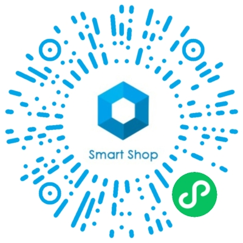
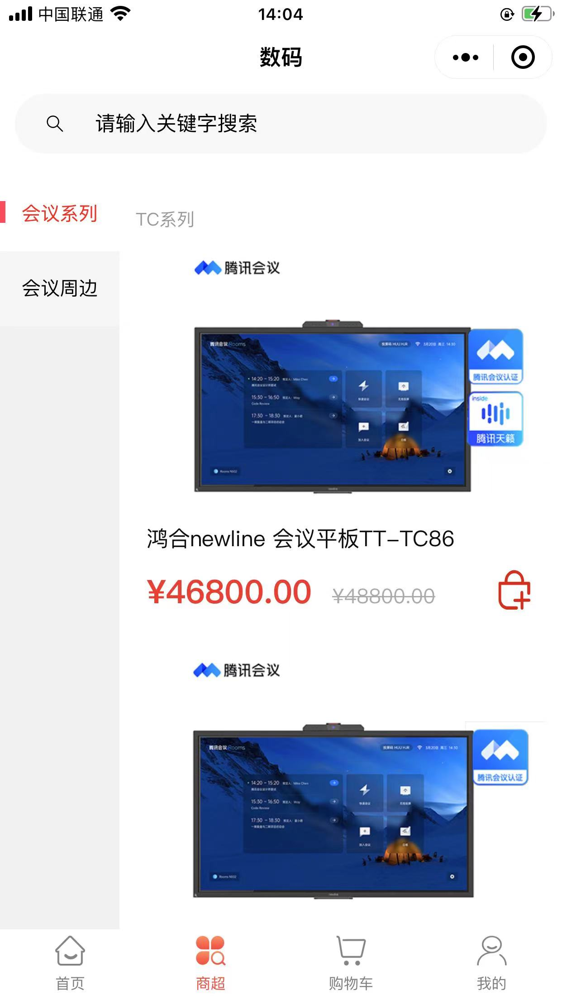
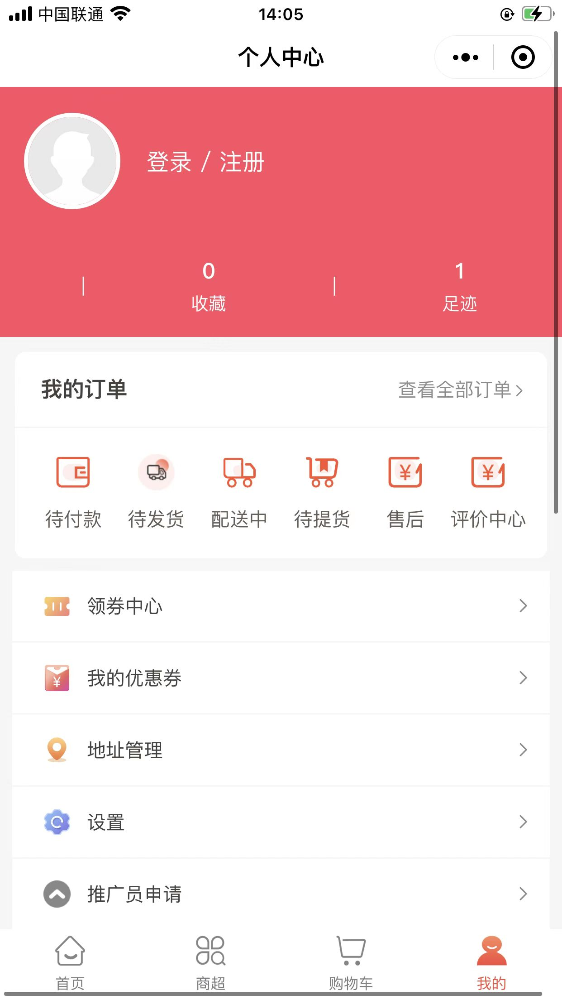
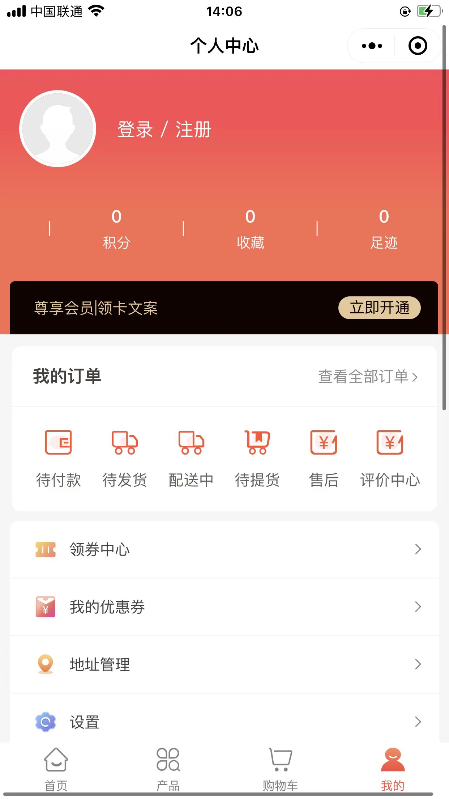

### 前言

期盼已久的经过 **百万真实用户沉淀并检验** 的企业级smart shop商城系统核心框架正式开源上架啦 :tada:  :tada:  :tada:    

我们承诺smart shop使用的开源框架完全免费，其余功能支持定制开发。由于SaaS系统研发投入成本高，迄今已超过300w人民币。在此对【中国石油】、【贵州茅台】【轩妈蛋黄酥】等基于本系统进行二次开发的知名企业表示感谢！

我们希望通过gitee平台能让更多的人了解smart shop商城系统，获得大家认可的同时也希望大家对smartshop提出宝贵的意见，帮助我们不断对系统进行迭代优化，使Smart Shop成为 **Java程序员的首选商城框架** ！！

最新推出一款以低代码开发的应用平台，是通过可视化的交互方式，不仅可以将原本复杂多变的业务逻辑通过拖、拉、拽的方式快速搭建应用，还可以更低的成本去为企业提供更稳定的服务，有兴趣的小伙伴可移至官网查看。  

| 交流群：smart shop商城 | 交流群：社区团购  | 技术微信 |
|--------|--------|--------|
|||

### 项目介绍
Smart Shop是一款基于 **Spring Cloud** +MybatisPlus+XXL-JOB+redis+Vue的前后端分离、分布式、微服务架构的Java商城系统，采用稳定框架开发及优化核心，减少依赖，具备出色的执行效率，扩展性、稳定性高，H5/小程序/APP三端合一数据打通，Smart shop将持续收集大家反馈不断更新迭代，并经过了生产环境**反复线上论证**和**大量真实用户数据使用**的考验。

### 郑重声明
近期发现市场上有人冒充smart shop工作人员通过售卖盗版smart shop商城系统源码非法获益，在此我们郑重声明：非经过本公司官方渠道购买的smart shop源码出现任何问题我们概不负责。

使用违法获取的盗版系统，存在很多的数据安全隐患，还会带来法律风险，请大家共同监督，发现人员出售盗版系统，及时与我们联系，我们将依法追究其法律责任 :exclamation:  :exclamation:  :exclamation: 
### 荣誉资质
||||
|---|---|---|

### 技术架构
#### 运行环境（必备）

- CentOS 7.0+
- Nginx 1.10+
- MySQL 8.0+

#### 技术选型

| 技术                   | 说明                 | 官网                                                 |
| ---------------------- | -------------------- | ---------------------------------------------------- |
| Spring Cloud           | 微服务框架           | https://spring.io/projects/spring-cloud              |
| Spring Cloud Alibaba   | 微服务框架           | https://github.com/alibaba/spring-cloud-alibaba      |
| Spring Boot            | 容器+MVC框架         | https://spring.io/projects/spring-boot               |
| MyBatis-Plus           | 数据层代码生成       | http://www.mybatis.org/generator/index.html          |
| Swagger                | 文档生成工具         | https://swagger.io/     
|                                                                                                     |
| Elasticsearch          | 搜索引擎             | https://github.com/elastic/elasticsearch             |
| RabbitMq               | 消息队列             | https://www.rabbitmq.com/                            |
| Redis                  | 分布式缓存           | https://redis.io/                                    |
| Druid                  | 数据库连接池         | https://github.com/alibaba/druid                     |
| OSS                    | 对象存储             | https://github.com/aliyun/aliyun-oss-java-sdk        |
| JWT                    | JWT登录支持          | https://github.com/jwtk/jjwt                         |
| XXL-JOB                | 分布式任务调度平台   |https://www.xuxueli.com/xxl-job/                       |
|                                                                                                     |
| Lombok                 | 简化对象封装工具     | https://github.com/rzwitserloot/lombok               |
| Jenkins                | 自动化部署工具       | https://github.com/jenkinsci/jenkins                 |
| Docker                 | 应用容器引擎         | https://www.docker.com/                              |          
|Sonarqube				 | 代码质量控制	        |https://www.sonarqube.org/
|                                                                                                     |
| element                | 组件库         | https://element.eleme.cn/#/zh-CN                           |
| Vue.js                 | 渐进式JavaScript 框架       | https://cn.vuejs.org/                         |
| Vue-router 			 | 前端路由 		       | https://router.vuejs.org/zh/ 	       |
| vuex 					 | 状态管理            | https://vuex.vuejs.org/zh/ 		|			
| modeuse-core 			 | 自主开发UI组件       | -- 				                |
| TypeScript             | JavaScript超集       | https://www.tslang.cn/                                |
| eslint             	 | 代码质量控制         | https://eslint.org/                                   |                 
| hook	             	 | 代码质量控制         |                                                       |
| uniapp                 |            小程序模板 | https://uniapp.dcloud.io/README                |
|--------|-------|-----------------------------------|

#### 业务架构

| 业务架构 |
|------|
|      |
- gruul-platform-open平台模块
- gruul-account-open账户模块
- gruul-gateway-open网关
- gruul-order-open订单模块
- gruul-goods-open商品模块
- gruul-payment-open支付模块                                                                                     
- gruul-oss-openOSS模块
- gruul-afs-open售后模块
- gruul-shops-open店铺模块
- gruul-common-open公共模块
- gruul-logistics-open物流模块
- gruul-sms-open短信模块

####  编码规范

- 规范方式：后端严格遵守阿里编码规约，前端使用eslint； 
- 命名统一：简介最大程度上达到了见名知意；
- 分包明确：层级分明可快速定位到代码位置；
- 注释完整：描述性高大量减少了开发人员的代码阅读工作量；
- 工具规范：使用统一jar包避免出现内容冲突；
- 代码整洁：可读性、维护性更高。

 **代码位置** 

  商家端  :https://gitee.com/qisange/basemall/tree/master/group-mall-admin-source

  小程序端 :https://gitee.com/qisange/basemall/tree/master/group-shop-uniapp-wx-Source

  后端    :https://gitee.com/qisange/basemall/tree/master/gruul

  数据库  ：https://gitee.com/qisange/basemall/tree/master/gruul/init-default-sql

### 系统版本

####  开源版无加密
开源 Smart Shop 框架（已上线），**目的是帮助程序员快速搭建高性能商城** 。  

既然是框架，那么重点要解决的就是底层架构的复用问题，除了基础的用户、商品、订单、物流、售后等完整业务流程的功能外，其他业务模块不是开源的重点。我们承诺： **开源版 Smart Shop 框架永久免费无加密** 。商业版使用的底层框架，跟开源版完全相同，所以使用开源版的同学，可以轻松升级到商业版。

希望同学们在留言区积极提出想法建议，或者参与到开源版的bug修复、代码规范和源码贡献中去， **对于贡献较大的个人或团队，我们将授权其免费使用商业版 Smart Shop 源码** 。

 **允许** 

✅ 个人学习；

✅ 公益项目（请注明来源）。

🚫 **禁止** 
公有云厂商将其商业化。

####  商业版无限开

简称“商业版”，可以随时给需要商城源码的您部署上线，功能与在线SaaS企业版完全相同，可移步官网查看( https://www.bgniao.cn )。
 
推出商业版源码的目的，是为了保证产品持续迭代、长期发展。如此强大的商城SaaS系统，拿去就能实现商业无限开，它不香吗？

商业版包含：开源框架基础上实现的全套SaaS商城源码。

🚫 **禁止** ：将商业版源码公布至互联网，否则将追究其法律责任。

###  新产品上线 :star2: 
除了开源版我们的smart shop电商业务中台是基于java服务热插拔，大中台小前台架构思想来实现B2B、B2C、B2B2C等商业模式切换，更多有关产品详情可移步至：https://gitee.com/qisange/boss

### 交付清单

- 数据库初始化脚本
- 后台前端系统前端源码
- 小程序端源码
- 安装部署文档
- 后台接口文档
- 小程序端接口文档
- 操作手册.docx
- 纸质授权证书
- 增值税专用发票  

### 功能概要

- 商品管理：  上传商品、规格sku管理、商品上下架、分类管理等；
- 订单管理：  订单结算、购物车、订单支付、评价、售后等；
- 物流管理：  收发地址管理、物流发货、电子面单打印、小票打印、收货等；
- 会员管理：  会员卡、会员权益、会员管理、储值管理等；
- 营销管理：  优惠券、满减、积分商城、直播、社群接龙、环保回收等；
- 财务管理：  对账单、提现工单、财务报表导出等；
- 客户管理：  客户列表、自动标签、积分管理等；
- DIY装修：   支持所有页面DIY装修；
- 素材导入：  淘宝、天猫、拼多多、京东等电商平台一键导入商品素材；
- 供货商管理：平台供货商管理；
- oss对象存储 支持 阿里云 腾讯云 七牛云(加速图片读取速度)；
- sms短信服务 支持 腾讯云 阿里云；
- 支付服务    支持微信支付 余额支付 好友代付  使得商家提现费率更低 自动分账操作更为方便；
- 总台服务    控制商户入驻，及各种信息私有配置。

### 项目演示
||
|------|
###  演示地址
|商业版源码生产环境演示地址：https://mall.bgniao.cn/copartner/1.3.13/sign 账号：13157479071 密码：a123456|
|------|
|H5演示地址：https://mall.bgniao.cn/h5/10002#/|

|小程序端真机截图|
|------|
||

|Web真机截图|
|------|
||

###  典型客户案例
####  熊枫鲜生
> 专注做全球代购的平台，包含母婴用品、美妆护肤，食品和生鲜等产品，一开始使用的是微擎某商城，商城不满足使用需求，18年底的时候找到我们要做魔方装修、引导页和邀请码登陆等功能以便做分销和装修，恰好当时我们的产品有这些功能，所以可以直接在线使用，长期运营截止到现在 **_营业额总计5800万_** 

|||||
|---|---|---|---|

####  代购商城
> 主要经营奢侈品代购，商品全部香港直邮发货，原先某平台购买商城源码使用，一年不到功能不满足现有需求，售卖代码方一直联系不上，后来找到我们做了新人券、用户注册实名制（代购需要）、对接物流API、报表导出等功能，除了新人券其他的功能我们商城是满足的，所以在我们自有源码基础上做了新人券二开，二开后 **_营业额至今上百万_** 

||||| 
|---|---|---|---|

####  新线科技
> 新线科技一家专注于计算机、软件及辅助设备、电子产品销售等科技型公司，有着自己的技术团队。前期用的是PHP的营销商城，近几年客户量发展较快再加上所售产品价格较高，基于长期发展肯定需要更换商城的底层架构，必然会用到Spring Cloud，选择我们这套系统是技术成本较低的一个选择。

|   |   |   |   |
|---|---|---|---|

####  劲面堂
> 劲面堂，连锁品牌有着大量忠实粉丝的餐饮公司，对用户数据尤为看中，需要有一套属于自己公司的售卖系统。随着市场变化可随时做二次开发来满足市场需求长远考虑JAVA微服务架构是不二之选。

|   |   |   |   |
|---|---|---|---|

### 特别鸣谢

码农的心声，唯有码农能懂。在很长一段时间里团队十多个人加班到深夜，市场调研不断推翻重构才构建了Smart Shop。 在此特别鸣谢项目中付出大量心血的团队成员👨‍👩‍👦‍👦👨‍👩‍👧‍👧

项目发起人：启三哥

产品经理：美子、美少女

系统总架构师：范范

前端开发：斯巴达、罗天师yyds、龙哥、辣条

后端开发：白沙群岛、老头、杰哥、阴川蝴蝶君、阿帕奇、机器猫

测试：聂小倩、铁柱、佩奇、十又

运维：陈哥

💝 **如果觉得我们的项目对你有帮助，可点击右上角Watch、Star项目，获取项目第一时间更新，欢迎提交Issues和PR项目，如需需求文档、流程图联系技术获取！** 